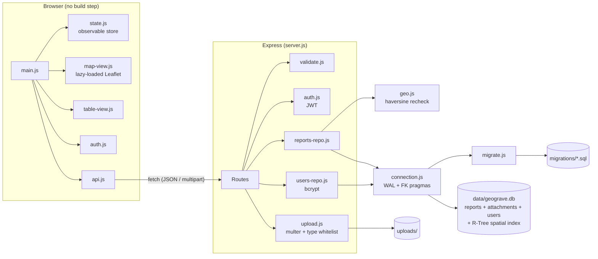
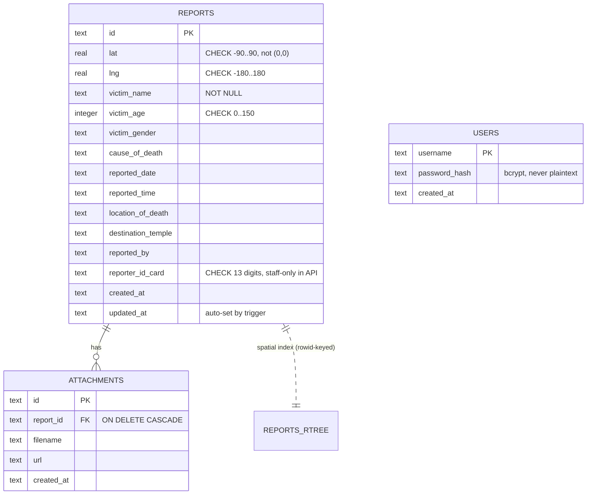

# GEOGrave

[](https://github.com/Atip-Infa/geograve/actions/workflows/ci.yml)
[](https://nodejs.org/)
[](LICENSE)
[](docker-compose.yml)

A map-based incident reporting application for logging and visualising road fatality data. Field officers drop a pin on an interactive map, fill in a structured form, and the record is stored with geospatial indexing for proximity search. Public visitors can view and submit reports; authenticated staff can edit, delete, and see reporter PII.

> **Data sensitivity notice.** This application stores personal data including victim names, ages, cause of death, and reporter national ID numbers. Read the [Security](#security) and [Deployment](docs/deployment.md) guides before running in any environment beyond your local machine.

---

## Table of Contents

- [Features](#features)
- [Stack](#stack)
- [Architecture](#architecture)
- [Data Engineering highlights](#data-engineering-highlights)
- [Quick start](#quick-start)
  - [Docker (recommended)](#docker-recommended)
  - [Without Docker](#without-docker)
- [Configuration](#configuration)
- [API reference](#api-reference)
- [Database](#database)
- [Testing](#testing)
- [Scripts](#scripts)
- [Documentation](#documentation)
- [Security](#security)
- [Contributing](#contributing)
- [License](#license)

---

## Features

- Interactive Leaflet map with marker clustering — click to place a pin and open the report form
- Toggle between map view and sortable/searchable table view
- Proximity search: `GET /api/points/near` returns reports within a configurable radius, sorted nearest-first
- PII redaction: reporter national ID is visible only to authenticated staff
- Staff authentication with JWT (8 h sessions, HS256, algorithm pinned)
- File attachments (photos, scanned docs) with MIME + extension whitelist
- Live stats dashboard (total reports, gender breakdown, 5 most recent)
- Fully responsive layout with screen-reader support (`aria-live`, skip link, visible focus)

## Stack

| Layer | Technology |
|---|---|
| Runtime | Node.js 22.5+ |
| HTTP framework | Express 4 |
| Database | SQLite (`node:sqlite`) — WAL mode, FK pragmas, R-Tree spatial index, ACID transactions |
| Auth | JWT (jsonwebtoken, HS256) + bcrypt password hashes |
| Validation | express-validator + database-level CHECK constraints |
| File uploads | Multer — MIME/extension whitelist, UUID-renamed on disk |
| Frontend | Plain HTML/CSS/ES modules + Leaflet.js + Leaflet.markercluster (no build step) |
| Packaging | Docker + docker-compose |
| Testing | Jest + Supertest (43 tests) |
| CI | GitHub Actions (Node 22 & 24 matrix + Docker smoke test) |

## Architecture



Full design narrative: [docs/architecture.md](docs/architecture.md)

**Write request flow** (`POST /api/points`):
Multer (file whitelist) → express-validator rules → `handleValidation` → route handler → `reports-repo.create()` (single `BEGIN IMMEDIATE` transaction: report row + attachment rows + R-Tree trigger) → response.

**Read request flow** (`GET /api/points`):
`attachUserIfPresent` (optional JWT decode) → `reportsRepo.listAll()` (prepared statement cache, batched N+1-free attachment fetch) → PII redaction for unauthenticated callers → response.

## Data Engineering highlights

This project is deliberately built to showcase patterns that matter in a Data Engineering context, not just web development:

| Pattern | Where |
|---|---|
| Versioned SQL migrations with rollback | `backend/lib/db/migrate.js` + `migrations/` |
| R-Tree spatial index (same two-phase strategy as PostGIS) | `migrations/001_init.sql`, `reports-repo.js#findNear` |
| Index coverage verified via `EXPLAIN QUERY PLAN` in tests | `tests/db.test.js` — query optimization suite |
| N+1 query elimination with regression test | `reports-repo.js#attachmentsForMany`, `tests/db.test.js` |
| Prepared-statement cache (parse-once, reuse per connection) | `lib/db/prepared-cache.js` |
| Cache-aside pattern with explicit write invalidation + TTL safety net | `reports-repo.js` — stats cache |
| ETL script with dry-run, idempotent re-runs, per-record error isolation | `scripts/migrate-json-to-sqlite.js` |
| Non-blocking consistent backup via `VACUUM INTO` | `scripts/backup.js` |
| Read-only data quality audit (post-ingestion profiling) | `scripts/data-quality-check.js` |
| Defense-in-depth: CHECK constraints duplicate API-layer validation | `migrations/001_init.sql` |
| WAL mode for concurrent readers without blocking writers | `lib/db/connection.js` |

Full write-up: [docs/data-pipeline.md](docs/data-pipeline.md) · [docs/database.md](docs/database.md)

## Quick start

Requires **Node.js 22.5+** (`node --version`). The database layer uses the built-in `node:sqlite` module added in that release.

### Docker (recommended)

```bash
# 1. Clone and enter the repository
git clone https://github.com/Atip-Infa/geograve.git
cd geograve

# 2. Configure secrets
cp backend/.env.example backend/.env
# Edit backend/.env — at minimum set JWT_SECRET (see Configuration below)

# 3. Start
docker compose up --build
```

Open **http://localhost:3002**. Data persists in `backend/data/geograve.db` and `backend/uploads/` via volume mounts, so it survives container restarts and rebuilds.

```bash
docker compose down        # stop
docker compose down -v     # stop and remove volumes (wipes data)
```

### Without Docker

```bash
cd backend
cp .env.example .env       # edit .env before continuing
npm install
npm start
```

Open **http://localhost:3000**.

For development with auto-restart, use `npm run dev` (runs with `NODE_ENV=development`).

## Configuration

Copy `backend/.env.example` to `backend/.env` and set the following:

| Variable | Required | Description |
|---|---|---|
| `JWT_SECRET` | **Yes** | Random secret for signing JWTs. Generate with: `node -e "console.log(require('crypto').randomBytes(48).toString('hex'))"` |
| `ADMIN_USERNAME` | No | Staff login username (default: `admin`) |
| `ADMIN_PASSWORD` | No | Staff login password. If blank, a random one-time password is generated and printed to the log on first boot — acceptable for local dev only |
| `PORT` | No | HTTP port (default: `3000`) |
| `NODE_ENV` | No | `development` / `production` / `test` |
| `ALLOWED_ORIGINS` | No | Comma-separated CORS origins. Leave empty for same-origin only (recommended when the frontend is served by this same process) |

The server **refuses to start** if `JWT_SECRET` is missing.

## API reference

| Method | Endpoint | Auth | Description |
|---|---|---|---|
| `POST` | `/api/auth/login` | No | Staff login — returns a JWT |
| `GET` | `/api/points` | Optional | List all reports. Unauthenticated: `reporterIdCard` redacted. Returns newest-first (`created_at DESC`). Supports `?limit=&offset=` pagination with `X-Total-Count` header |
| `GET` | `/api/points/near` | Optional | Reports within `radius_km` of `lat`,`lng`, nearest-first, each annotated with `distanceKm` |
| `GET` | `/api/points/:id` | Optional | Single report — same redaction rule as list |
| `POST` | `/api/points` | No | Create a report (multipart/form-data) |
| `PUT` | `/api/points/:id` | **Yes** | Partial update a report |
| `DELETE` | `/api/points/:id` | **Yes** | Delete a report (cascades to attachments) |
| `GET` | `/api/stats` | No | Dashboard summary: total, gender breakdown, 5 most recent |
| `GET` | `/healthz` | No | Health check — verifies DB connectivity, returns uptime and DB size |

Authenticate with `Authorization: Bearer <token>` from the login response.

Full reference with request/response examples: [docs/api.md](docs/api.md)

## Database

Three normalized tables (`reports`, `attachments`, `users`) with B-tree indexes on hot-path columns and an R-Tree virtual table for spatial queries:



Schema source of truth: `backend/lib/db/migrations/001_init.sql`

Full documentation including indexing rationale, migration system, and PostgreSQL migration path: [docs/database.md](docs/database.md)

## Testing

```bash
cd backend
npm test
```

43 tests across three files, each using its own isolated temporary SQLite database:

| File | What it covers |
|---|---|
| `tests/geo.test.js` | Haversine distance formula unit tests |
| `tests/db.test.js` | Migrations, schema CHECK constraints, transaction integrity, R-Tree sync, `EXPLAIN QUERY PLAN` index assertions, N+1 regression, stats cache |
| `tests/api.test.js` | Full HTTP integration: auth flow, PII redaction, upload type rejection, orphaned-file regression, geospatial search, JWT algorithm pinning |

CI runs the full suite on Node 22 and 24, then builds the Docker image and verifies its healthcheck passes. See [`.github/workflows/ci.yml`](.github/workflows/ci.yml).

## Scripts

All scripts run from `backend/`:

| Command | Description |
|---|---|
| `npm run db:seed [-- N]` | Populate N sample reports (default 20) clustered around real Thai locations for spatial search demos. **Never run against production data.** |
| `npm run migrate:json-to-sqlite [-- --dry-run]` | ETL: migrate legacy `data/points.json` to SQLite. `--dry-run` previews what would happen without writing anything |
| `npm run db:backup [-- /path/to/dir]` | Consistent non-blocking snapshot via `VACUUM INTO`. Schedule with cron/systemd in production |
| `npm run db:quality-check` | Read-only data quality audit: missing fields, duplicate coordinates/names, malformed IDs, orphaned attachments |

Full write-up: [docs/data-pipeline.md](docs/data-pipeline.md)

## Documentation

| Document | Contents |
|---|---|
| [docs/architecture.md](docs/architecture.md) | System design, component responsibilities, request flows, engineering decisions |
| [docs/database.md](docs/database.md) | Full schema reference, indexing strategy, migration system, backup & recovery, PostgreSQL migration path |
| [docs/api.md](docs/api.md) | Complete API reference with request/response examples for every endpoint |
| [docs/data-pipeline.md](docs/data-pipeline.md) | ETL, seeding, backup, and data quality scripts explained in detail |
| [docs/deployment.md](docs/deployment.md) | Docker, environment variables, reverse proxy config, backup schedule, production checklist |
| [CONTRIBUTING.md](CONTRIBUTING.md) | Development setup, branch conventions, PR process |
| [SECURITY.md](SECURITY.md) | Vulnerability reporting, security posture summary |
| [CHANGELOG.md](CHANGELOG.md) | Version history |

## Security

- `JWT_SECRET` is required at startup — the server will not boot without it
- Uploaded files are restricted to JPG, PNG, WEBP, GIF, PDF (10 MB each, 5 per report); on-disk filenames are UUID-generated, never derived from user input
- Rate limiting on all API routes, with tighter limits on `/api/auth/login` and `POST /api/points`
- Reporter national ID is never returned to unauthenticated callers
- CSP headers restrict script/style/image sources to known CDNs and self
- bcrypt (cost 12) for password hashing; timing-safe dummy hash for unknown usernames

See [SECURITY.md](SECURITY.md) for the full posture summary and vulnerability reporting process.

## Contributing

See [CONTRIBUTING.md](CONTRIBUTING.md).

## License

[MIT](LICENSE)
