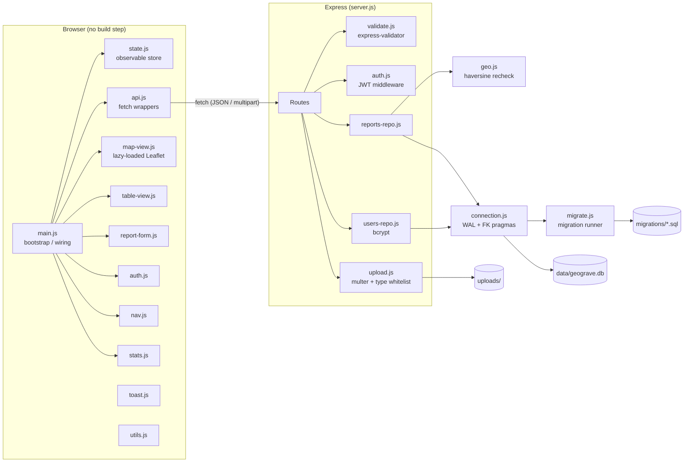

# Architecture

This document describes GEOGrave's system design: component responsibilities, data flow, and the reasoning behind structural decisions.

---

## Table of Contents

- [System overview](#system-overview)
- [Component map](#component-map)
- [Request flows](#request-flows)
  - [Write: creating a report](#write-creating-a-report)
  - [Read: listing reports](#read-listing-reports)
  - [Spatial search](#spatial-search)
- [Frontend architecture](#frontend-architecture)
- [Backend architecture](#backend-architecture)
  - [Middleware stack](#middleware-stack)
  - [Repository layer](#repository-layer)
  - [Database layer](#database-layer)
- [Engineering decisions](#engineering-decisions)

---

## System overview

GEOGrave is a single-host web application: one Node.js process serves the API, the static frontend, and uploaded files. The database is SQLite, co-located on the same host. There is no separate frontend build step, no external services, and no message queue.

This is a deliberate scope decision (see [Engineering decisions](#engineering-decisions)), not an oversight. The architecture is appropriate for the problem — a government field-reporting tool for one organisation — and the documented migration path to PostgreSQL makes the tradeoffs explicit.

```
Internet
   │
   ▼
[nginx / ALB]  ← optional reverse proxy for TLS termination
   │
   ▼
[Node.js / Express]
   ├── GET /               → serves public/index.html (SPA)
   ├── GET /uploads/*      → serves uploaded files (static, forced download header)
   ├── POST /api/auth/*    → auth routes
   ├── GET|POST|PUT|DELETE /api/points/* → reports routes
   ├── GET /api/stats      → stats route
   └── GET /healthz        → health check
        │
        ▼
   [SQLite — WAL mode]
        ├── reports table
        ├── attachments table (ON DELETE CASCADE)
        ├── users table
        ├── reports_rtree (R-Tree spatial index)
        └── schema_migrations table
```

---

## Component map



---

## Request flows

### Write: creating a report

`POST /api/points` with `multipart/form-data`:

```
1. createLimiter          — rate limit (60 req / 15 min)
2. upload.array()         — multer writes files to disk, validates MIME + extension
3. createPointRules       — express-validator: lat/lng bounds, null-island, field lengths
4. handleValidation       — if errors: delete any files multer already wrote, return 400
5. route handler
6. reportsRepo.create()
   ├── BEGIN IMMEDIATE    — acquire write lock upfront (avoids lock-upgrade deadlocks)
   ├── INSERT INTO reports
   ├── INSERT INTO attachments (for each file)
   ├── AFTER INSERT trigger → INSERT INTO reports_rtree  (R-Tree stays in sync)
   └── COMMIT
7. reportsRepo.findById() — re-read the created row to return the canonical shape
8. serializePoint()       — redact reporterIdCard for unauthenticated callers
9. HTTP 201 + JSON body
```

If anything in step 6 throws (e.g. a CHECK constraint fires), the transaction rolls back atomically — no partial rows are written.

### Read: listing reports

`GET /api/points`:

```
1. attachUserIfPresent    — try to decode JWT; don't block if absent/invalid
2. reportsRepo.listAll()
   ├── prep(db, 'SELECT * FROM reports ...')  — cached prepared statement
   ├── attachmentsForMany()                   — single batched query for ALL attachments
   └── toApiShape() per row                   — snake_case → camelCase mapping
3. .map(p => serializePoint(p, req))          — PII redaction for unauthenticated callers
4. HTTP 200 + JSON array
```

With pagination (`?limit=&offset=`): the same flow runs against the paginated query; `X-Total-Count` is set from `reportsRepo.count()`.

### Spatial search

`GET /api/points/near?lat=13.7563&lng=100.5018&radius_km=5`:

```
1. attachUserIfPresent
2. Validate lat / lng / radius_km query params inline (no express-validator for query params)
3. reportsRepo.findNear(lat, lng, radiusKm)
   ├── Compute bounding box (lat ± latDelta, lng ± lngDelta)
   ├── R-Tree indexed bounding-box query → small candidate set (O(log n))
   ├── rowsToApiShape() on candidates (batched attachment fetch)
   └── haversineDistanceKm() exact recheck + filter + sort on candidate set only
4. serializePoint() per result
5. HTTP 200 + { center, radiusKm, count, points }
```

The bounding box overestimates (its corners extend beyond the true circle), so the haversine recheck is not optional — it is what produces the correct result. This two-phase approach is the same strategy PostGIS uses internally for `ST_DWithin` / KNN queries.

---

## Frontend architecture

The frontend is plain HTML/CSS/JavaScript with no build step, bundler, or framework. Each concern is an ES module loaded via `<script type="module">` in `index.html`.

| Module | Responsibility |
|---|---|
| `main.js` | App bootstrap, wires all modules together, handles initial data load |
| `state.js` | Observable store — holds the current report list; map-view and table-view subscribe to changes |
| `api.js` | Typed fetch wrappers for every API endpoint; centralises auth header injection |
| `map-view.js` | Leaflet map initialisation (lazy-loaded), marker clustering, click-to-report |
| `table-view.js` | Sortable/searchable table; row click jumps to map pin |
| `report-form.js` | Slide-in form for creating/editing reports |
| `auth.js` | Login dialog, token storage, logout |
| `stats.js` | Populates the home-page stats dashboard from `GET /api/stats` |
| `nav.js` | Responsive navigation with mobile hamburger |
| `toast.js` | `aria-live` toast notifications |
| `lazy-leaflet.js` | Deferred Leaflet + MarkerCluster loading (map tiles only load when the map tab is opened) |
| `utils.js` | Shared formatting helpers |

**State flow:** `main.js` fetches reports from the API and pushes them into `state.js`. `map-view.js` and `table-view.js` subscribe to state changes and re-render independently. Mutations (create, update, delete) go through `api.js`, which updates state on success — no double-fetching.

---

## Backend architecture

### Middleware stack

Applied to all requests, in order:

1. `helmet` — security headers (CSP, HSTS, X-Frame-Options, etc.)
2. `compression` — gzip response bodies
3. `morgan` — HTTP access logging (`combined` in production, `dev` in development, silent in test)
4. Slow-request logger — JSON `warn` line for any response exceeding 200 ms
5. `cors` — configurable via `ALLOWED_ORIGINS` env var (defaults to same-origin)
6. `express.json` — JSON body parsing (1 MB limit)
7. Route-level rate limiters (applied per-route, not globally)

### Repository layer

`reports-repo.js` and `users-repo.js` are the only modules that touch the database. `server.js` calls repository functions; it never calls `db.prepare()` directly.

This boundary means:
- The snake_case ↔ camelCase mapping (`toApiShape`) exists in exactly one place.
- Tests can import the repository layer directly without starting an HTTP server.
- The storage engine can be swapped (e.g. to PostgreSQL) by rewriting the repository files without touching routes.

### Database layer

Three files in `lib/db/`:

| File | Responsibility |
|---|---|
| `connection.js` | Opens the SQLite connection, sets WAL/FK/busy_timeout pragmas, runs pending migrations on startup |
| `migrate.js` | Reads numbered `.sql` files from `migrations/`, applies each exactly once, tracks applied versions in `schema_migrations` |
| `prepared-cache.js` | WeakMap-keyed per-connection cache of prepared statements — each SQL string is parsed once per connection |

---

## Engineering decisions

These tradeoffs were made deliberately and are worth understanding before proposing changes.

### SQLite instead of PostgreSQL

SQLite was chosen for zero-external-infrastructure setup: no separate database server or container. It provides a real schema, real B-tree and R-Tree indexes, and real ACID transactions — the previous JSON file store had none of these.

Two honest caveats:
- `node:sqlite` is still marked experimental in Node (used here with full test coverage as a signal it works reliably enough for this project's scale).
- SQLite's WAL mode provides safe concurrent access across multiple processes on **one host**, but not across **multiple hosts**. True horizontal scaling requires a client-server database.

**PostgreSQL + PostGIS** is the documented next step for multi-host deployments. The migration script (`scripts/migrate-json-to-sqlite.js`) is a template for what a SQLite → PostgreSQL migration script would look like.

### One shared staff account

A single `admin` account is enough to gate destructive actions behind authentication. For a genuine multi-officer rollout, per-user accounts with an audit trail (who changed what, when) would be required. This is documented in `SECURITY.md` and the README rather than silently deferred.

### Public report creation, authenticated editing/deletion

Anyone can submit a report without logging in — zero friction on the core "report an incident" workflow. Only edit, delete, and viewing the reporter's national ID require authentication. This asymmetry matches the tool's actual purpose.

### Vanilla JS frontend

No React, Vue, or build step. The app is small enough that ES modules give the same component/state-isolation benefits without introducing a bundler, framework version, or transpilation pipeline. A single `<script type="module">` chain is enough at this scale.

### No ORM

The schema is defined in plain SQL migration files — the authoritative source of truth. An ORM would add a dependency that generates SQL the project cannot directly inspect or test, while the existing `EXPLAIN QUERY PLAN` test suite requires direct control over the exact query shapes being executed.
