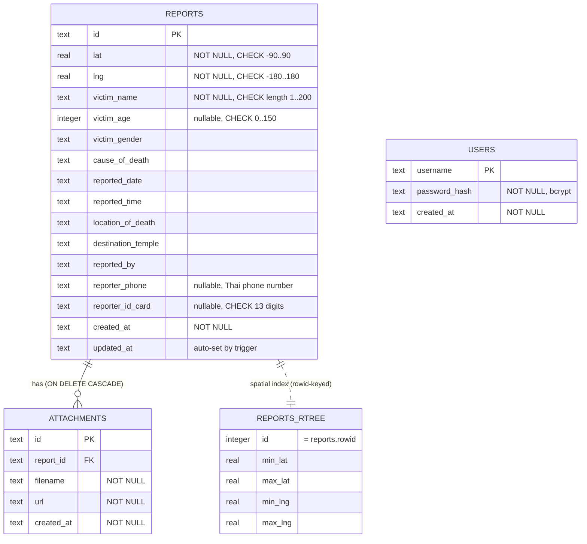

# Database

GEOGrave uses SQLite via Node.js's built-in `node:sqlite` module (added in Node 22.5). This document covers the schema, indexing strategy, migration system, spatial indexing, backup and recovery, and the migration path to PostgreSQL.

---

## Table of Contents

- [Schema](#schema)
  - [reports](#reports)
  - [attachments](#attachments)
  - [users](#users)
  - [schema_migrations](#schema_migrations)
- [Entity-relationship diagram](#entity-relationship-diagram)
- [Indexing strategy](#indexing-strategy)
  - [B-tree indexes](#b-tree-indexes)
  - [R-Tree spatial index](#r-tree-spatial-index)
- [Constraints and validation](#constraints-and-validation)
- [Triggers](#triggers)
- [Migration system](#migration-system)
- [Query optimization](#query-optimization)
- [Caching](#caching)
- [Backup and recovery](#backup-and-recovery)
- [SQLite configuration](#sqlite-configuration)
- [PostgreSQL migration path](#postgresql-migration-path)

---

## Schema

Schema source of truth: `backend/lib/db/migrations/001_init.sql`

### reports

One row per incident report. All writes go through `lib/db/reports-repo.js`.

| Column | Type | Constraints | Notes |
|---|---|---|---|
| `id` | TEXT | PRIMARY KEY | UUID v4, generated in application code |
| `lat` | REAL | NOT NULL, CHECK -90..90 | Latitude |
| `lng` | REAL | NOT NULL, CHECK -180..180 | Longitude |
| `victim_name` | TEXT | NOT NULL, CHECK length 1..200 | |
| `victim_age` | INTEGER | nullable, CHECK 0..150 | NULL stored for empty/unknown |
| `victim_gender` | TEXT | nullable | Free text; Thai language in practice |
| `cause_of_death` | TEXT | nullable | |
| `reported_date` | TEXT | nullable | ISO 8601 date string (YYYY-MM-DD) |
| `reported_time` | TEXT | nullable | HH:MM |
| `location_of_death` | TEXT | nullable | |
| `destination_temple` | TEXT | nullable | Thai mortuary/temple destination |
| `reported_by` | TEXT | nullable | Name of the person submitting the report |
| `reporter_phone` | TEXT | nullable | Thai phone number — stored as text to preserve formatting |
| `reporter_id_card` | TEXT | nullable, CHECK 13 digits | Thai national ID. Never returned to unauthenticated API callers. |
| `created_at` | TEXT | NOT NULL, DEFAULT now() | ISO 8601 UTC timestamp |
| `updated_at` | TEXT | nullable | Set by trigger on any UPDATE; also set in application code |
| *(composite)* | | CHECK NOT (lat=0 AND lng=0) | Null-island rejection — (0,0) is a common default/missing value signature |

### attachments

Evidence photos and scanned documents linked to a report.

| Column | Type | Constraints | Notes |
|---|---|---|---|
| `id` | TEXT | PRIMARY KEY | UUID v4 |
| `report_id` | TEXT | NOT NULL, FK → reports(id) ON DELETE CASCADE | Deleting a report automatically removes its attachments |
| `filename` | TEXT | NOT NULL | Original filename (sanitised, max 200 chars) |
| `url` | TEXT | NOT NULL | `/uploads/<uuid>.<ext>` |
| `created_at` | TEXT | NOT NULL, DEFAULT now() | |

### users

Staff accounts. Only bcrypt hashes are stored — plaintext passwords never touch the database.

| Column | Type | Constraints | Notes |
|---|---|---|---|
| `username` | TEXT | PRIMARY KEY | |
| `password_hash` | TEXT | NOT NULL | bcrypt, cost factor 12 |
| `created_at` | TEXT | NOT NULL, DEFAULT now() | |

### schema_migrations

Tracks which migration files have been applied. Managed entirely by `lib/db/migrate.js`.

| Column | Type | Notes |
|---|---|---|
| `version` | TEXT PRIMARY KEY | Filename without `.sql`, e.g. `001_init` |
| `applied_at` | TEXT | ISO 8601 UTC timestamp |

---

## Entity-relationship diagram



---

## Indexing strategy

### B-tree indexes

Three additional B-tree indexes cover the hot-path queries:

| Index | Table | Column | Covers |
|---|---|---|---|
| `idx_reports_created_at` | reports | `created_at DESC` | Recent-first listings; stats dashboard top-5 query |
| `idx_reports_victim_name` | reports | `victim_name` | Search/filter by victim name |
| `idx_attachments_report_id` | attachments | `report_id` | Attachment lookup per report (avoids full table scan) |

All three indexes are verified with `EXPLAIN QUERY PLAN` assertions in `tests/db.test.js`. A future schema change that accidentally defeats an index (e.g. wrapping a column in a function call) fails the test suite rather than silently degrading to a full scan.

### R-Tree spatial index

`reports_rtree` is an SQLite [R-Tree virtual table](https://www.sqlite.org/rtree.html) that indexes each report as a minimum bounding rectangle:

```sql
CREATE VIRTUAL TABLE reports_rtree USING rtree(
  id,               -- maps to reports.rowid (integer, not the UUID text id)
  min_lat, max_lat,
  min_lng, max_lng
);
```

For a point geometry, `min_lat = max_lat = lat` and `min_lng = max_lng = lng`.

**Two-phase proximity search** (the same strategy PostGIS uses for `ST_DWithin`):

1. Compute a bounding box from the search radius and query coordinate.
2. R-Tree indexed bounding-box lookup → small candidate set in O(log n).
3. Exact haversine distance recheck on candidates only → correct result.

The bounding box overestimates (its corners extend past the true circle), so the haversine recheck is not optional. Its cost is paid only against the small candidate set returned by step 2, not against every row.

The index is kept in sync automatically via three triggers (`reports_rtree_insert`, `reports_rtree_update`, `reports_rtree_delete`) defined in the same migration. See [Triggers](#triggers).

---

## Constraints and validation

Validation is layered: the API layer catches bad input early and returns a clean 400 with field-level detail; the database layer is a second, independent line of defense.

| Constraint | API layer | DB layer |
|---|---|---|
| `lat` in [-90, 90] | express-validator | CHECK on `reports.lat` |
| `lng` in [-180, 180] | express-validator | CHECK on `reports.lng` |
| `(lat, lng) ≠ (0, 0)` | custom validator | Composite CHECK on `reports` |
| `victim_name` non-empty | express-validator | CHECK length ≥ 1 |
| `victim_age` in [0, 150] | express-validator | CHECK on `reports.victim_age` |
| `reporter_id_card` is 13 digits | regex in express-validator | GLOB pattern CHECK |
| `attachments.report_id` references a report | N/A | FOREIGN KEY |

The database-layer CHECK constraints exist because the API is not the only possible write path. Future batch import jobs, admin scripts, or direct SQL console access all bypass Express — the schema enforces data integrity regardless of how data arrives.

---

## Triggers

### R-Tree sync triggers

Defined in `migrations/001_init.sql`:

```sql
-- Insert: add the new point to the spatial index
CREATE TRIGGER reports_rtree_insert AFTER INSERT ON reports BEGIN
  INSERT INTO reports_rtree (id, min_lat, max_lat, min_lng, max_lng)
  VALUES (new.rowid, new.lat, new.lat, new.lng, new.lng);
END;

-- Update: move the entry in the spatial index when coordinates change
CREATE TRIGGER reports_rtree_update AFTER UPDATE OF lat, lng ON reports BEGIN
  UPDATE reports_rtree
  SET min_lat = new.lat, max_lat = new.lat, min_lng = new.lng, max_lng = new.lng
  WHERE id = new.rowid;
END;

-- Delete: remove the entry from the spatial index
CREATE TRIGGER reports_rtree_delete AFTER DELETE ON reports BEGIN
  DELETE FROM reports_rtree WHERE id = old.rowid;
END;
```

These triggers mean that callers never need to manually maintain the spatial index — it is guaranteed consistent by the schema.

### updated_at trigger

Defined in `migrations/002_updated_at_trigger.sql`:

```sql
CREATE TRIGGER reports_touch_updated_at
AFTER UPDATE ON reports
WHEN NEW.updated_at IS OLD.updated_at OR NEW.updated_at IS NULL
BEGIN
  UPDATE reports SET updated_at = strftime('%Y-%m-%dT%H:%M:%fZ', 'now') WHERE id = NEW.id;
END;
```

`updated_at` is maintained at the database level so any write path — application code, admin scripts, direct SQL — keeps it current. The `WHEN` guard prevents a recursive trigger loop when `updated_at` is already being set in the same statement.

---

## Migration system

Migrations are numbered `.sql` files in `backend/lib/db/migrations/`:

```
001_init.sql                — initial schema: reports, attachments, users, indexes, R-Tree
002_updated_at_trigger.sql  — updated_at auto-maintenance trigger
```

**How it works** (`lib/db/migrate.js`):
1. On every `getDb()` call, `runMigrations()` checks `schema_migrations` for already-applied versions.
2. Pending `.sql` files are applied in filename order (zero-padded numerics sort correctly as strings).
3. Each migration runs inside a transaction: success → `INSERT INTO schema_migrations`; failure → `ROLLBACK` with a clear error message.
4. Re-running migrations on an already-up-to-date database is a safe no-op.

**Adding a migration:**
1. Create `backend/lib/db/migrations/NNN_description.sql`.
2. Write idempotent SQL (`IF NOT EXISTS` guards where applicable).
3. Update this document and `CHANGELOG.md`.
4. Run `npm test` — the migration runner is exercised by `tests/db.test.js`.

This pattern is identical in spirit to Flyway, Alembic, and Knex migrations, without introducing a framework dependency.

---

## Query optimization

### Prepared statement cache

`lib/db/prepared-cache.js` caches prepared statements per connection using a `WeakMap`:

```javascript
const stmtCache = new WeakMap();

function prep(db, sql) {
  let cache = stmtCache.get(db);
  if (!cache) { cache = new Map(); stmtCache.set(db, cache); }
  let stmt = cache.get(sql);
  if (!stmt) { stmt = db.prepare(sql); cache.set(sql, stmt); }
  return stmt;
}
```

`node:sqlite`'s `db.prepare()` re-parses and re-plans on every call. `prep()` ensures each distinct SQL string is parsed once per connection and reused on subsequent calls. A new connection (e.g. a test's temporary database) automatically gets its own independent cache with no manual invalidation.

### N+1 elimination

`listAll()` and `findNear()` previously called `attachmentsFor(reportId)` inside a `.map()` over the result set — one query per report. For N reports that produced N+1 total queries.

`attachmentsForMany(db, reportIds)` replaces this:

```javascript
// 1 query for reports + 1 batched query for all their attachments = 2 total
const rows = db.prepare(
  `SELECT id, report_id, filename, url FROM attachments
   WHERE report_id IN (${placeholders}) ORDER BY created_at ASC`
).all(...reportIds);
```

This is verified by a regression test in `tests/db.test.js` that counts `db.prepare()` calls during a `listAll()` of 20 reports and asserts the count stays at or below 2.

### EXPLAIN QUERY PLAN tests

`tests/db.test.js` contains a suite that verifies each declared index is actually used by the SQLite query planner:

```javascript
test('victim_name search uses idx_reports_victim_name', () => {
  const detail = planDetail(db, 'SELECT * FROM reports WHERE victim_name = ?', 'x');
  expect(detail).toMatch(/USING INDEX idx_reports_victim_name/);
});
```

These tests catch query plan regressions — a schema change that accidentally makes an index unusable (e.g. an implicit type coercion) will fail the test suite.

---

## Caching

`GET /api/stats` aggregates over the entire `reports` table on every call. This is a classic cache-aside candidate:

- **Cache invalidation:** every write operation (`create`, `update`, `remove`) calls `invalidateStatsCache()` immediately. The cache is never more than one stale request after a mutation.
- **TTL safety net:** 30 seconds, covering the case where a write path ever misses the invalidation call.
- **Scope:** in-process only. No Redis or external cache dependency is needed at this project's scale.

---

## Backup and recovery

### Creating a backup

```bash
npm run db:backup                    # writes to backend/data/backups/
npm run db:backup -- /mnt/backups    # custom output directory
```

Backups use SQLite's `VACUUM INTO`:

```sql
VACUUM INTO '/path/to/backup-2025-01-01T12-00-00.db'
```

`VACUUM INTO` produces a complete, consistent snapshot in a single atomic operation. Readers and writers on the live database are not blocked while it runs — unlike a naive `cp` of the `.db` file, which can copy a partially-written page if a write is in progress.

The backup file is a fully valid SQLite database. No special restore tooling is required.

### Restoring from a backup

1. Stop the application (`docker compose down` or `Ctrl-C`).
2. Replace `backend/data/geograve.db` with the backup file.
3. Restart the application.

### Recommended schedule

Run `npm run db:backup` on a cron or systemd timer (hourly or daily depending on write volume). Ship the output directory to off-host storage — a backup that only lives on the same disk as the live database does not protect against disk or host failure.

Example cron entry:
```cron
0 * * * * cd /app && node scripts/backup.js >> /var/log/geograve-backup.log 2>&1
```

---

## SQLite configuration

Applied in `lib/db/connection.js` before any queries run:

| PRAGMA | Value | Reason |
|---|---|---|
| `journal_mode` | `WAL` | Write-Ahead Logging: concurrent readers do not block behind writers. Safe across multiple processes on one host. |
| `foreign_keys` | `ON` | SQLite disables FK enforcement by default. Required for `ON DELETE CASCADE` to work. |
| `busy_timeout` | `5000` | Wait up to 5 s when the database is locked (e.g. a long write) before returning `SQLITE_BUSY`. Prevents spurious errors under brief contention. |

---

## PostgreSQL migration path

SQLite is appropriate for a single-host deployment at this project's scale. For multi-host horizontal scaling, PostgreSQL is the natural next step.

**What changes:**
- Replace `node:sqlite` with `pg` (node-postgres) or a query builder like `kysely`.
- Replace the R-Tree virtual table with a `geography` or `geometry` column and a `GiST` index (`CREATE INDEX ON reports USING GIST (ST_MakePoint(lng, lat)::geography)`).
- Replace `VACUUM INTO` backup with `pg_dump` / `pg_basebackup`.
- The `findNear` two-phase logic can be replaced with a PostGIS `ST_DWithin` query — same semantic, native spatial indexing.
- Migration files stay as `.sql`; the migration runner (`migrate.js`) needs minimal changes to use the `pg` client.
- CHECK constraints, trigger logic, and the `schema_migrations` table are all standard SQL and transfer directly.

The ETL script (`scripts/migrate-json-to-sqlite.js`) is a template for what a data migration script to PostgreSQL would look like: per-record validation, idempotent re-runs, dry-run preview, and per-record error isolation.
